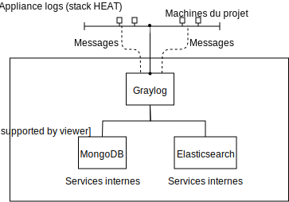
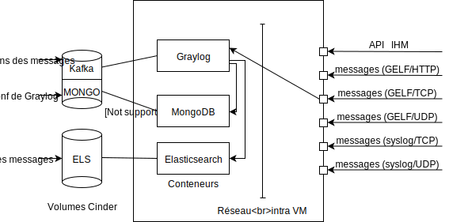
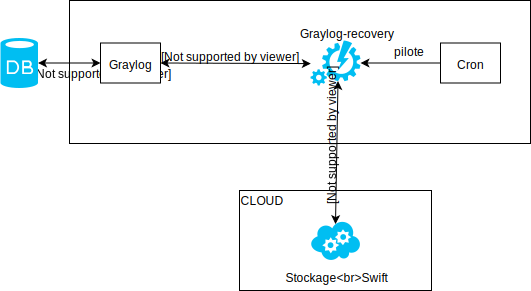
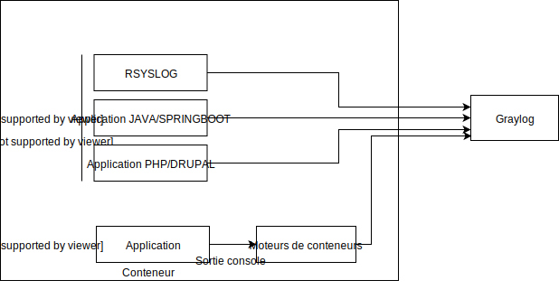

# Présentation de l'appliance 

C'est une application de centralisation et d'exploitation de logs utilisant l'outil Graylog.

Le document va présenter le fonctionnement de l'appliance à travers plusieurs schémas:  
- L'architecture technique de l'appliance;  
- L'appliance dans le projet;  
- L'envoi de la donnée vers le cloud;  
- L'envoi de la donnée vers l'appliance;  

## Architecture technique de l'appliance

Le schéma ci-dessous explique le fonctionnement général de l’appliance:  

  

Les machines du projet envoient des logs vers l’appliance.  

L’appliance contient Graylog et des applications en backoffice: Elasticsearch et MongoDB.  

Graylog est un service publié aux utilisateurs contrairement aux services internes qui ne sont pas atteignables par les utilisateurs  
  

## L'appliance dans le projet

Ce schéma précise le fonctionnement de l'appliance:  

  

Des messages sont envoyées par l'API REST et différents types de protocoles vers l'appliance. Ces services sont rendus par Graylog pour traitement.  
Les conteneurs Graylog, MongoDB et Elasticsearch stockent leurs fichiers dans des volumes Cinder séparés:  
- Kafka stocke les tampons des messages  
- MongoDB stocke la configuration de graylog  
- ELS stocke les messages  

## L'envoi des données vers le cloud

Le schéma ci-dessous représente la sauvegarde et la restauration des données vers l'application:  

  

Les échanges entre graylog et graylog-recovery ainsi qu'entres graylog-recovery et swift se font en webservices.  

Cron est un outil qui permet de faire des taches planifiés. Ici, il s’occupe de lancer graylog-recovery régulièrement.  

## L'envoi de la données vers l'appliance

Le schéma montre comment les informations sont envoyées de l’instance applicative vers l’appliance graylog:  

Deux cas se présentent:  
- soit l’application possède un support natif de l’envoi des logs (ex : RSYSLOG, Application JAVA/SPRINGBOOT, application PHP/DRUPAL). L'envoi se fait directement vers l’appliance.  

- soit l’application ne possède pas de support natif: L’application est alors installé dans un conteneur. Une sortie console vers des moteurs de conteneurs permet l’envoi vers l’appliance Graylog.  

