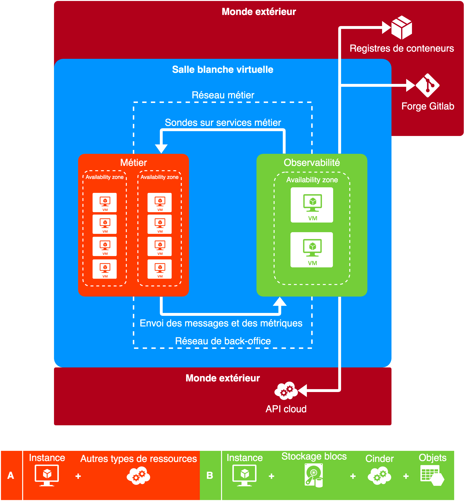
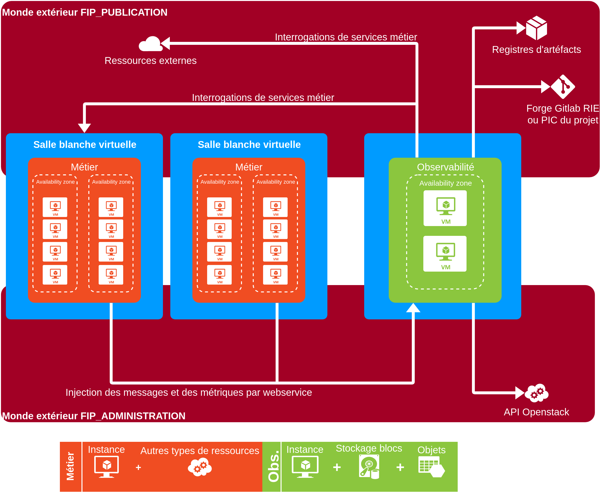
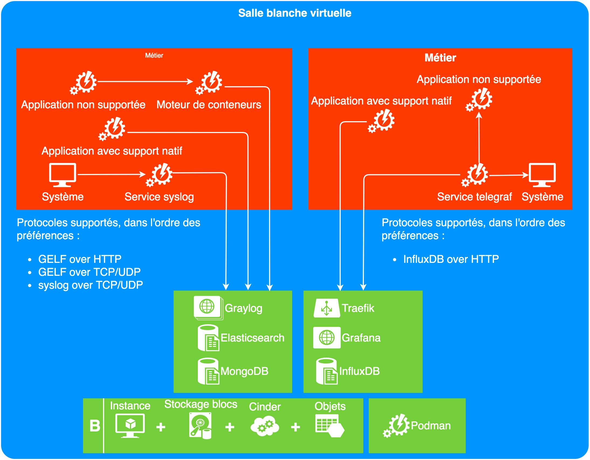

# Architecture Applicative

## Schéma fonctionnel

## Description des briques

La solution se présente sous la forme d'une paire d'instances auto-configurées. 
Celles-ci sont prêtes à recevoir des données de la part des ressources du 
projet.

Fonctionnalités :

* tableaux de bord personnalisables ;
* règles de réécriture de messages ;
* seuils d'alertes ;
* gestion des rétentions.

SCHEMA À MODIFIER

Listes des logiciels utilisés avec leurs fonctions et la raison de leurs choix:

- Graylog v3.1: il permet la récupération, la sauvegarde et la restauration des logs ;
- Elasticsearch v5 ou 6: c'est un logiciel interne à graylog non visible par les utilisateurs ;
- MongodDB v3.6 ou 4.0: c'est un logiciel interne à graylog non visible par les utilisateurs ;
- Influxdb v2: Il permet la récupération, la sauvegarde et la restauration des métriques ;
- Traefik v2:
- Grafana v5.4:
- Telegraf v2.6: Il permet l'envoie de métriques des applications n'ayant pas la fonction nativement;
- Podman v1.7: Il est plus sécurisé et supporte REDHAT 8.

La brique exécute des conteneurs. Ces conteneurs à utiliser sont hébergés sur le Nexus interne du cloud. Il se repose sur le mécanisme de sécurité de Nexus.

Notion d'application supportée? Concept à préciser et à illustrer d'exemples.

## Dimensionnement

En fonction de la quantité de données à traiter (nombre de messages, nombre de 
métriques, fréquence d'envoi) ainsi que de la durée de rétention, les gabarits 
et la taille du stockage sont à sélectionner.

## Projection à 5 ans

En fonction de la vie du projet utilisateur.

## Performances

* TODO: faire des tirs de performances.
* Expériences précédentes : 6000 messages / seconde estimé à 3 To (à calculer) 
La fréquence de purge est à discrétion du chef de produit.
