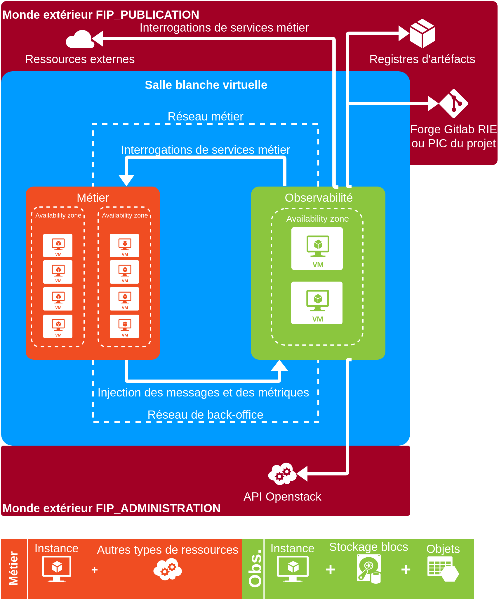
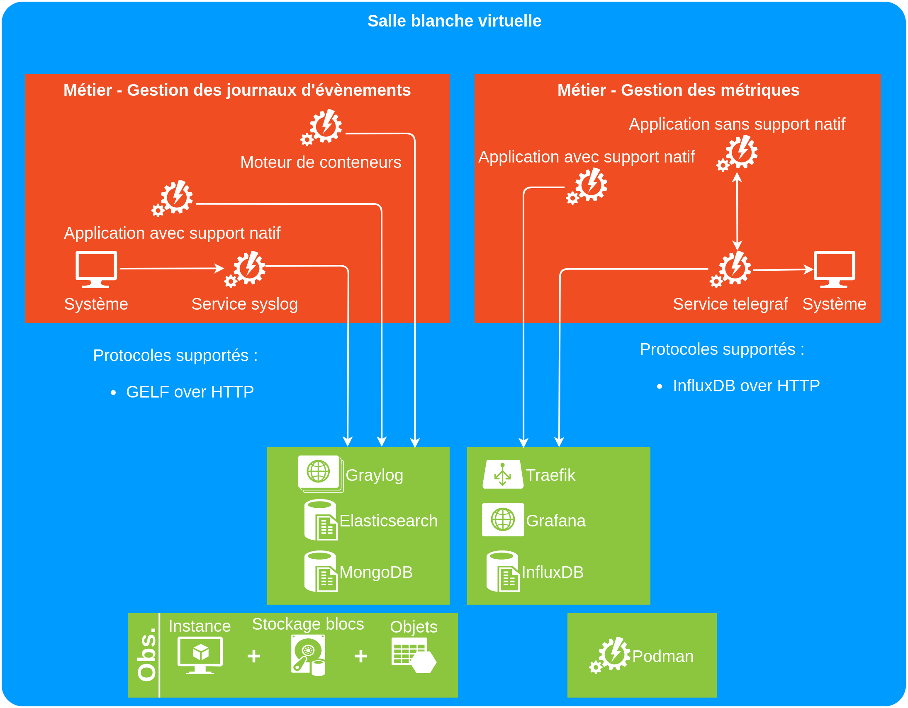

-   [Architecture Applicative](#architecture-applicative)
    -   [Schéma fonctionnel](#schéma-fonctionnel)
        -   [Déploiement dédié](#déploiement-dédié)
        -   [Déploiement mutualisé](#déploiement-mutualisé)
    -   [Description des briques](#description-des-briques)
    -   [Dimensionnement](#dimensionnement)
    -   [Projection à 5 ans](#projection-à-5-ans)
    -   [Performances](#performances)

Architecture Applicative
========================

Schéma fonctionnel
------------------

Les schémas proposés plus bas utilisent certains termes définis comme
suit :

-   un service métier externe : webservice intéressant à surveiller pour
    connaître le bon fonctionnement du projet (partenaire, APIM,
    proxy...) ;

-   API Openstack : webservices fournis par l'hébergeur pour piloter les
    ressources. Il est essentiel de surveiller ces éléments afin de
    savoir si le projet est en mesure d'être piloté correctement,
    surtout en ce qui concerne le stockage objets `swift` ;

-   injection des messages et des métriques : les applications et les
    serveurs envoient leurs données aux webservices d'observabilité mis
    à disposition par les solutions. On restreint les protocoles d'envoi
    de données aux HTTP / HTTPS afin de modeler la solution pour être
    installée au sein de différentes topologies ;

-   le monde extérieur FIP\_PUBLICATION est le réseau sur lequel les
    adresses accessibles aux utilisateurs sont réservées. Un routeur est
    créé par le projet afin de le relier au réseau des flux métiers
    (*front-office*) du tenant ;

-   le monde extérieur FIP\_ADMINISTRATION est le réseau sur lequel les
    adresses accessibles aux administrateurs et aux services socles sont
    réservées. Un routeur est créé par le projet afin de le relier au
    réseau des services techniques (*back-office*) du tenant.

Deux cas d'utilisation sont proposés : un déploiement dédié à un projet
et un autre mutualisé.

Dans le premier cas, les appliances d'observabilité sont installées dans
le même espace projet que les ressources métier. Cette approche n'est
pas ètrs efficiente en terme de consommation de ressources. En effet,
plusieurs freins apparaissent :

-   la surconsommation des ressources : les projets n'ont pas une taille
    critique nécessitant des outils dédiés. La réservation de puissance
    et d'espace mémoire n'est donc pas optimal et ne participe pas à
    l'approche éco-responsable et économique ;

-   la multiplication des outils d'exploitation.

La décentralisation des outils d'exploitation permet de répartir les
efforts et les contraintes sur plusieurs systèmes. À cet effet, un juste
milieu doit être trouvé entre le pur centralisé et le complètement
dédié. Il est donc possible de déployer les services clés-en-main par
équipe d'exploitation mutualisée, par exemple :

    -   par ESI d'exploitation ;
    -   par bureau de développement ;
    -   par domaine métier (cf. plan d'occupation des sols).

C'est lors du CAI du projet que le mode de déploiement est défini et
validé.

### Déploiement dédié

Les services d'observabilité sont déployés dans la salle blanche
virtuelle (`tenant`) de l'application à exploiter.

Le réseau où transitent les données métier n'est pas utilisé pour
communiquer avec les appliances. Dans le cas où les outils
d'observailité sont utilisés pour monitorer des ressources externes
(proxy, forge) alors seulement dans ce cas, on utilisera le réseau
applicatif.

Quant à lui, le réseau de services techniques (*back-office*) est
utilisé afin d'accéder aux services d'observabilité qui n'ont pas besoin
d'être publiés sur le réseau applicatif.

### Déploiement mutualisé

Les flux sont les mêmes que supra. Le `tenant` d'installation diffère.
Dans cette configuration un espace projet mutualisé comprend tous les
outils d'exploitation qui servent à plusieurs projets sous la
responsabilités d'une même équipe.

Description des briques
-----------------------

La solution se présente sous la forme d'une paire d'instances
pré-configurées. Celles-ci sont prêtes à recevoir des données de la part
des ressources du projet.

Fonctionnalités :

-   tableaux de bord personnalisables ;
-   règles de réécriture de messages ;
-   seuils d'alertes ;
-   gestion des rétentions.

Listes des logiciels utilisés avec leurs fonctions et la raison de leurs
choix:

-   Graylog v3.x: application de gestion des journaux d'évènements ;
-   Elasticsearch v6.x: indexeur de messages. Il est interne à Graylog
    et n'est pas visible par les utilisateurs ;
-   MongodDB v3.x: base de documents NoSQL pour stocker la configuration
    de Graylog. Elle est interne à Graylog et n'est pas visible par les
    utilisateurs ;
-   Influxdb v2 : base de données de métriques, moteur de visualisation
    et d'alertes de supervision ;
-   Traefik v2 : service de publication des services Grafana et InfluxDB
    sur les ports HTTP / HTTPS usuel ;
-   Grafana v6.x : moteur de visualisation de métriques ;
-   Telegraf v1.4: collecteur de métriques à installer sur les machines.
    Il permet l'envoi des métriques systèmes et des applications n'ayant
    pas la fonction d'envoi natif vers InfluxDB ;
-   Podman v1.x: moteur de conteneurs soutenu par Redhat. Il est plus
    sécurisé que le moteur Docker. Il est utilisé en interne par
    l'appliance mais n'est pas visible des utilisateurs. Il n'y a aucune
    adhérence avec les réalisations de l'équipes projet.

La brique exécute des conteneurs. Ils sont hébergés sur le dépôt Nexus
de Nubo, disponible pour les projets Openstack. Les mécanismes de
sécurité sont intégrés à la solution Nexus.

Une application avec un support natif représente les piles
technologiques capables d'intéragir directement avec les outils
d'observabilité : envoi autonome de messages et de métriques. Il s'agit
des composants construits autour des cadriciels Lombok / Spring (Java)
et Drupal (PHP).

Dimensionnement
---------------

En fonction de la quantité de données à traiter (nombre de messages,
nombre de métriques, fréquence d'envoi) ainsi que de la durée de
rétention, les gabarits et la taille du stockage sont à sélectionner.

La gestion des quotas très souple des projet sur Openstack permet une
augmentation de la puissance disponible en quelques jours.

À la place des projections à 5 ans pour déterminer le dimensionnement,
la solution proposée ici permet deux choses :

-   la remontée très rapide des métriques d'observabilité à l'équipe
    projet
-   la capacité des "ops" de redimensionner et l'allouer de nouvelles
    ressources très rapidement et donc de changer le dimensionnement
    pour mettre en place cette appliance et donner

Axes de rétention des logs :

-   nombre de messages
-   durée
-   taille sur disque

1 VM crache en moyenne N messages / seconde et M métriques / seconde, à
savoir X Go par an.

Performances
------------

-   TODO: faire des tirs de performances.
-   Liens vers la passerelle SMA SI-2B: TODO: demander à la DOMCSS le
    protocole à utiliser afin d'envoyer des alertes.
